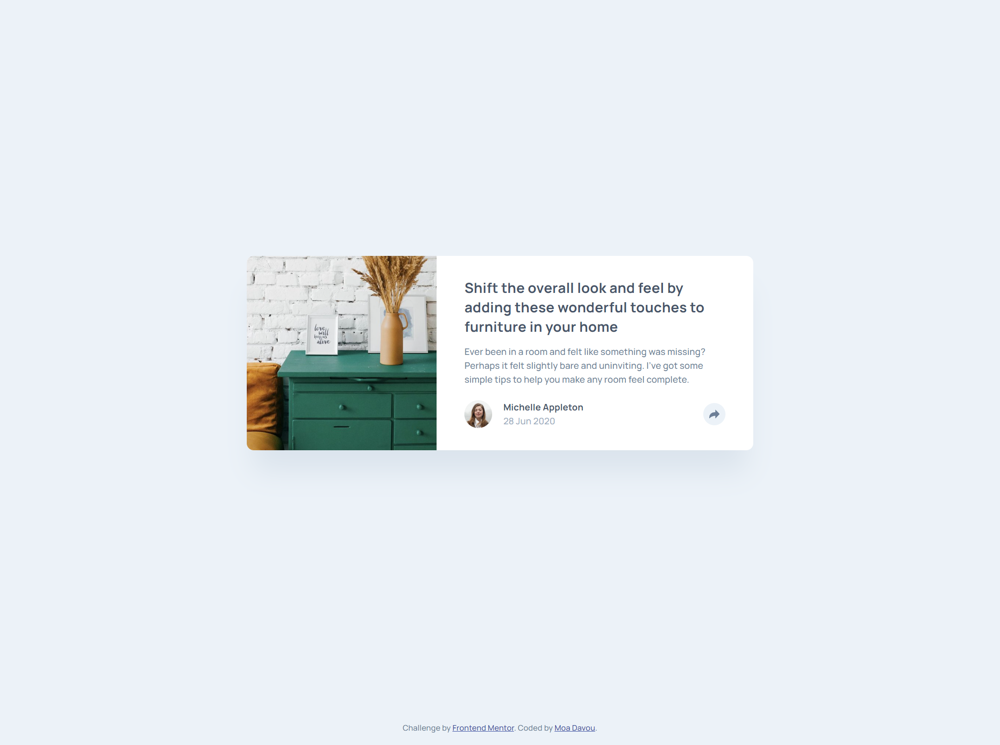

# Frontend Mentor - Article preview component solution

This is a solution to the [Article preview component challenge on Frontend Mentor](https://www.frontendmentor.io/challenges/article-preview-component-dYBN_pYFT). Frontend Mentor challenges help you improve your coding skills by building realistic projects.

## Table of contents

-   [Overview](#overview)
    -   [The challenge](#the-challenge)
    -   [Screenshot](#screenshot)
    -   [Links](#links)
-   [Setup & Usage](#setup--usage)
-   [My process](#my-process)
    -   [Built with](#built-with)
    -   [What I learned](#what-i-learned)
    -   [Continued development](#continued-development)
    -   [Useful resources](#useful-resources)
-   [Author](#author)

## Overview

### The challenge

Users should be able to:

-   View the optimal layout for the component depending on their device's screen size
-   See the social media share links when they click the share icon

### Screenshot



### Links

-   Repository URL: [GitHub](https://github.com/moadavou/article-preview-component)
-   Live Site URL: [GitHub Pages](https://moadavou.github.io/article-preview-component/)

## Setup & Usage

After you clone this repo to your desktop, go to its root directory and run `npm install` to install its dependencies.

Once the dependencies have been installed, you can run `npm start` to access the website's live server in your browser. You will then be able to access it at [localhost:3000](http://localhost:3000).

When the project is ready for deployment, run `npm run build` to compile the scss and sass files to css, minimize, autoprefix, and purge unwanted classes.

## My process

### Built with

-   Semantic HTML5 markup
-   CSS custom properties
-   Flexbox
-   CSS Grid
-   Mobile-first workflow

*   [CUBE CSS](https://cube.fyi/) - CSS methodology
*   [Sass](https://sass-lang.com/) _(v1.77.2)_ - CSS pre-processor

### What I learned

For this challenge, I had a few issues with the positioning of the image and the popup.

**I tried to have the image adjust its size based on a parenting div**, but I had a hard time with it. On mobile, the image overflowed its container, and on larger screens, the image was too small. In the end, I decided to move all the styling directly to the image. This is the approach I have used in the past, and I found it way easier to work with.

_Finished code for the image:_

```css
.card__img {
    width: 100%;
    height: 100%;
    max-height: 12.5rem;
    object-fit: cover;
    object-position: 0;
    border-radius: 10px 10px 0 0;

    @include breakpoint {
        max-height: none;
        border-radius: 10px 0 0 10px;
    }
}
```

I'm not used to positioning `position: absolute;` elements, so **I found working with the popup difficult.** It was a lot of trial and error. I think I need more practice with these kinds of elements. In addition, I also had some issues with the popup on larger screens in regards to that it has to overflow the card. I had set an `overflow: hidden;` on the card to get the border radiuses on the elements on top of the card to adjust automatically. This approach did not work due to the popup. In hindsight, I could have planned this better to save myself some time.

_Parts of the finished code for the share button popup:_

```css
.share-button-popup {
    position: absolute;
    align-items: center;
    display: flex;
    visibility: hidden;
    opacity: 0;
    gap: 1.31rem;
    height: 100%;
    width: 100%;
    bottom: 0;
    right: 0;
    padding-left: 32px;
    background-color: var(--clr-neutral-600);
    border-radius: 0 0 10px 10px;
    transition: opacity 200ms ease-in-out;
    z-index: 1;
}

@include breakpoint {
    .share-button-popup::after {
        content: "";
        position: absolute;
        top: 3.4rem;
        left: 50%;
        transform: translateX(-50%);
        width: 0;
        height: 0;
        border-left: 16px solid transparent;
        border-right: 16px solid transparent;
        border-top: 16px solid var(--clr-neutral-600);
    }
}
```

Surprisingly, the JavaScript wasn't hard. I'm not used to the syntax, and I had to look up a few things. But overall, it went smoothly.

### Continued development

I need to work more with JavaScript (to get used to the syntax) and absolutely positioned elements. I feel like I lack experience in these parts of front-end development.

### Useful resources

-   [CSS Triangle](https://css-tricks.com/snippets/css/css-triangle/) - This helped me understand how to create a triangle in CSS and why it works.

## Author

-   Frontend Mentor - [@moadavou](https://www.frontendmentor.io/profile/moadavou)
-   LinkedIn - [@moadavou](https://www.linkedin.com/in/moadavou/)
